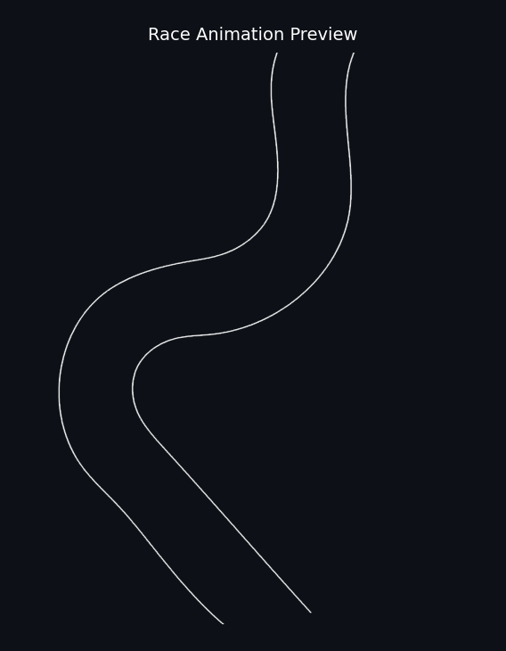

# PathRacer

> **Note:** If you've found your way here from my resume — whether you're considering me for a role or preparing for an interview — welcome! This entire project was built from scratch by me. All of the algorithm design, physics modeling, and implementation are my own original work. This documentation was written by me and then reworded with the help of AI and Grammarly for clarity and phrasing. I fully understand everything here and can explain any part of it on the spot if needed. Apologies in advance for the informal commenting and annotations throughout the code — that's just how I write when I'm in the zone.

Draw paths on a track, race them with real physics, and compare against the mathematically optimal route.



## What it does

You give it a track image and some hand-drawn paths as PNGs. It extracts the centerline from each stroke, runs physics on them (wall penalties, curvature-based speed limits, acceleration caps, jerk smoothing), and then animates the whole thing as a race. Paths get colored by speed so you can see where you're fast and where you're slow.

On top of that, it computes the theoretical best path using the Fast Marching Method. So you can actually see how close (or far) your hand-drawn line is from optimal.

## Setup

```bash
git clone https://github.com/DaviBaum/Racing-Line-Sim-Opt.git
cd Racing-Line-Sim-Opt
pip install -r requirements.txt
```

You'll need FFmpeg for MP4 export. On Mac that's `brew install ffmpeg`, on Linux `apt install ffmpeg`.

## Running a race

From the command line:

```bash
python cli.py \
    --road examples/inputs/road_map.png \
    --paths yellow=examples/inputs/path_yellow.png \
            green=examples/inputs/path_green.png \
            pink=examples/inputs/path_pink.png \
    --output race.mp4
```

Or from Python:

```python
from pathracer import run_race

result = run_race(
    road_path="examples/inputs/road_map.png",
    stroke_paths={
        "yellow": "examples/inputs/path_yellow.png",
        "green": "examples/inputs/path_green.png",
        "pink": "examples/inputs/path_pink.png",
    },
    output_path="race.mp4",
)

for name, time in sorted(result["total_times"].items(), key=lambda x: x[1]):
    print(f"{name}: {time:.2f}s")
```

## Configuring the physics

All the physics parameters live in `SimConfig` in config.py. The defaults are tuned for typical track images but you can override anything:

```python
from pathracer import SimConfig, run_race

cfg = SimConfig(v_base=150.0, wall_penalty=5.0, a_max=400.0)
result = run_race("track.png", {"fast": "path.png"}, cfg=cfg)
```

The ones you'd most likely want to tweak are `v_base` (top speed on open road), `wall_penalty` (how much being near a wall slows you down), and `a_max` / `a_lat_max` (longitudinal and lateral acceleration caps). The `j_window` parameter controls how aggressively the jerk filter smooths out the speed profile.

## Track format

Track PNGs use the alpha channel: transparent pixels are driveable road, opaque pixels are walls. That's the only requirement.

Path PNGs are colored strokes on a transparent background. The actual stroke color doesn't matter for the physics, it just determines the display color in the animation.

## How the pipeline works

There's a more detailed writeup in [docs/how_it_works.md](docs/how_it_works.md), but at a high level:

1. **Centerline extraction** — Skeletonize each hand-drawn stroke to a 1px spine, find the two farthest endpoints, trace between them, and smooth with a Savitzky-Golay filter.
2. **Optimal path (FMM)** — Upsample the driveable mask 8x, run Fast Marching to get a travel-time field, trace back through the gradient with RK4, then clean it up with elastic-band relaxation.
3. **Speed profiling** — Compute curvature everywhere, apply wall proximity and curvature speed limits, run forward/backward acceleration sweeps, and smooth the result with another Savitzky-Golay pass.
4. **Animation** — Resample all paths to uniform timesteps and render with matplotlib. Speed is shown via a turbo colormap (blue = slow, red = fast) and train emoji markers race along each path.

## License

MIT

---
